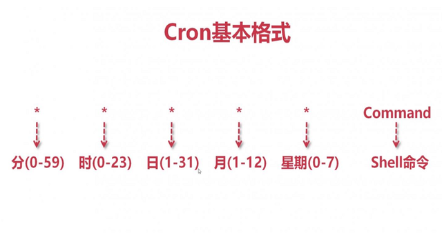

### Cron 表达式
表达式：
> 秒 分 时 日 月 周 年(可选)。

字段名| 允许的值  |   允许的特殊字符  
--- |--- |--- |
秒 |                        0-59  |                             , - * /  
分    |                      0-59 |                               , - * /  
小时  |                    0-23  |                              , - * /  
日 |                         1-31  |                              , - * ? / L W C  
月  |                        1-12 or JAN-DEC  |        , - * /  
周几 |                     1-7 or SUN-SAT  |          , - * ? / L C #  
年 (可选字段) |     empty, 1970-2099  |     , - * /

符号|描述
--- | :---
?| 表示不确定的值
,|指定数个值
-|指定一个值的范围
/|指定一个值的增加幅度。n/m表示从n开始，每次增加m
L|用在日表示一个月中的最后一天，用在周表示该月最后一个星期X
W|指定离给定日期最近的工作日(周一到周五)
#|表示该月第几个周X。6#3表示该月第3个周五
### 范例：
描述 | 表达式
:--- | :---
每隔5秒执行一次|*/5 * * * * ?
每隔1分钟执行一次|0 */1 * * * ?
每天23点执行一次|0 0 23 * * ?
每天凌晨1点执行一次|0 0 1 * * ?
每月1号凌晨1点执行一次|0 0 1 1 * ?
每月最后一天23点执行一次|v0 0 23 L * ?
每周星期天凌晨1点实行一次|0 0 1 ? * L
在26分、29分、33分执行一次|0 26,29,33 * * * ?
每天的0点、13点、18点、21点都执行一次|0 0 0,13,18,21 * * ?

## Cron表达式
* Cron表达式是一个字符串，字符串以5或6个空格隔开，分为6或7个域，每一个域代表一个含义，Cron有如下两种语法格式：
> Seconds Minutes Hours DayofMonth Month DayofWeek Year
> 
> 或
> 
> Seconds Minutes Hours DayofMonth Month DayofWeek

* 每一个域可出现的字符如下：
>
字段 | 允许的值
---: | :---
Seconds|可出现", - * /"四个字符，有效范围为0-59的整数
Minutes|可出现", - * /"四个字符，有效范围为0-59的整数
Hours|可出现", - * /"四个字符，有效范围为0-23的整数
DayofMonth|可出现", - * / ？ L W C"八个字符，有效范围为0-31的整数
Month|可出现", - * /"四个字符，有效范围为1-12的整数或JAN-DEc
DayofWeek|可出现", - * / ？ L C #"四个字符，有效范围为1-7的整数或SUN-SAT两个范围。1表示星期天，2表示星期一， 以此类推
Year|可出现", - * /"四个字符，有效范围为1970-2099年

### cron表达式
> 一个cron表达式有至少6个（也可能7个）有空格分隔的时间元素。

字段| 允许值 |允许的特殊字符
---: | :--- | :---
秒 | 0-59 |  ， - * /
分 |  0-59 |  ， - * /
小时 |  0-23 |  ， - * /
日期 |  1-31 | , - * ？ / L W C
月份 |  1-12 或者 JAN-DEC |  , - * /
星期 |  1-7 或者 SUN-SAT  | , - * ？ / L C #
年(可选) 留空 | ， 1970-2099  | , - * /

* *表达式，是由数字、算符、数字分组符号（括号）、自由变量和约束变量等以能求得数值的有意义排列方法所得的组合。*
* *约束变量在表达式中已被指定数值，而自由变量则可以在表达式之外另行指定数值。*

## Cron表达式
 
> 在执行云助手命令时，您可以调用API通过Timed参数和Frequency参数设置命令的执行时间。Frequency的取值为一个Cron表达式，适用于周期性执行、日常维护、在某时刻需要完成的单次任务等场景。

### Cron表达式介绍
> Cron表达式是一个具有时间含义的字符串，字符串以5~6个空格隔开，分为6~7个域，格式为X X X X X X X。其中X是一个域的占位符。最后一个代表年份的域非必须，可省略。单个域有多个取值时，使用半角逗号,隔开取值。每个域可以是确定的取值，也可以是具有逻辑意义的特殊字符。每个域最多支持一个前导零。

### 域取值
1. 下表为Cron表达式中六个域能够取的值以及支持的特殊字符。

域 | 是否必需 | 取值范围 | 特殊字符 
---- | ------ |-----| ----
秒|       是	|[0, 59]|	*, - /
分钟|	是	|[0, 59]|	* , - /
小时|	是	|[0, 23]|	* , - /
日期|	是	|[1, 31]|	* , - / ? L W
月份|	是	|[1, 12]或[JAN, DEC]|	* , - /
星期|	是	|[1, 7]或[MON, SUN]。若您使用[1, 7]表达方式，1代表星期一，7代表星期日。|	* , - / ? L #
年|	否	|[当前年份，2099]|	* , - /

### 特殊字符
> Cron表达式中的每个域都支持一定数量的特殊字符，每个特殊字符有其特殊含义。

特殊字符|	含义|	示例
--- |--- |--- |
*|	所有可能的值。|	在月域中，*表示每个月；在星期域中，*表示星期的每一天。
,	列出枚举值|。	在分钟域中，5,20表示分别在5分钟和20分钟触发一次。
-|	范围。|	在分钟域中，5-20表示从5分钟到20分钟之间每隔一分钟触发一次。
/|	指定数值的增量。|	在分钟域中，0/15表示从第0分钟开始，每15分钟。在分钟域中3/20表示从第3分钟开始，每20分钟。
?|	不指定值，仅日期和星期域支持该字符。|	当日期或星期域其中之一被指定了值以后，为了避免冲突，需要将另一个域的值设为?。
L|	单词Last的首字母，表示最后一天，仅日期和星期域支持该字符。 *说明 指定L字符时，避免指定列表或者范围，否则，会导致逻辑问题*| 在日期域中，L表示某个月的最后一天。在星期域中，L表示一个星期的最后一天，也就是星期日（SUN）。 如果在L前有具体的内容，例如，在星期域中的6L表示这个月的最后一个星期六。
W|	除周末以外的有效工作日，在离指定日期的最近的有效工作日触发事件。|W字符寻找最近有效工作日时不会跨过当前月份，连用字符LW时表示为指定月份的最后一个工作日。	在日期域中5W，如果5日是星期六，则将在最近的工作日星期五，即4日触发。如果5日是星期天，则将在最近的工作日星期一，即6日触发；如果5日在星期一到星期五中的一天，则就在5日触发。定每个月第几个星期几，仅星期域支持该字符。	在星期域中，4#2表示某月的第二个星期四。

### 取值示例
> 以下为Cron表达式的取值示例。

示例|	说明|
:--- |--- |
0 15 10 ? * *	|每天上午10:15执行任务
0 15 10 * * ?	|每天上午10:15执行任务
0 0 12 * * ?	|每天中午12:00执行任务
0 0 10,14,16 * * ?	|每天上午10:00点、下午14:00以及下午16:00执行任务
0 0/30 9-17 * * ?	|每天上午09:00到下午17:00时间段内每隔半小时执行任务
0 * 14 * * ?	|每天下午14:00到下午14:59时间段内每隔1分钟执行任务
0 0-5 14 * * ?	|每天下午14:00到下午14:05时间段内每隔1分钟执行任务
0 0/5 14 * * ?	|每天下午14:00到下午14:55时间段内每隔5分钟执行任务
0 0/5 14,18 * * ?	|每天下午14:00到下午14:55、下午18:00到下午18:55时间段内每隔5分钟执行任务
0 0 12 ? * WED	|每个星期三中午12:00执行任务
0 15 10 15 * ?	|每月15日上午10:15执行任务
0 15 10 L * ?	|每月最后一日上午10:15执行任务
0 15 10 ? * 6L	|每月最后一个星期六上午10:15执行任务
0 15 10 ? * 6#3	|每月第三个星期六上午10:15执行任务
0 10,44 14 ? 3 WED	|每年3月的每个星期三下午14:10和14:44执行任务
0 15 10 ? * * 2022	|2022年每天上午10:15执行任务
0 15 10 ? * * *	|每年每天上午10:15执行任务
0 0/5 14,18 * * ? 2022	|2022年每天下午14:00到下午14:55、下午18:00到下午18:55时间段内每隔5分钟执行任务
0 15 10 ? * 6#3 2022,2023	|2022年至2023年每月第三个星期六上午10:15执行任务
0 0/30 9-17 * * ? 2022-2025	|2022年至2025年每天上午09:00到下午17:30时间段内每隔半小时执行任务
0 10,44 14 ? 3 WED 2022/2	|从2022年开始，每隔两年3月的每个星期三下午14:10和14:44执行任务
