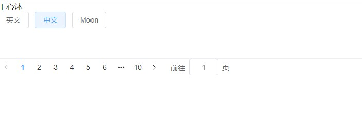
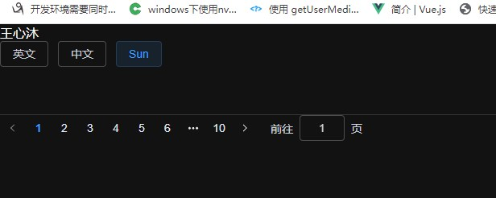
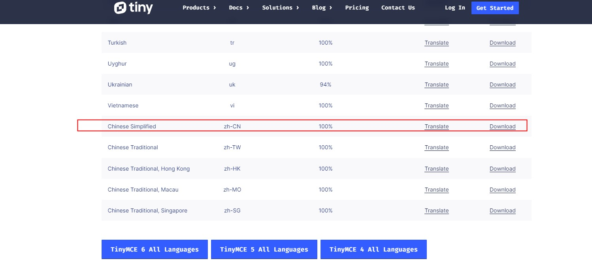

# 项目构建
> 参考 [project-build](../documents/buildProject/project-build.md)  文件

# Project build Process
## 一、代码规范
> eslintrc.cjs/js/json
```js
/* eslint-env node */
require('@rushstack/eslint-patch/modern-module-resolution')

module.exports = {
  root: true,
  'extends': [
    'plugin:vue/vue3-essential',
    'eslint:recommended',
    '@vue/eslint-config-typescript'
  ],
  parserOptions: {
    ecmaVersion: 'latest'
  },
  rules: {
    // 'semi': ['error', 'never'],// 去掉结尾分号
    // 'quotes': ['error', 'single'],// 单引号

    'quotes': [2, 'single', { 'avoidEscape': true, 'allowTemplateLiterals': true }], // 使用单引号
    'semi': [2, 'never'], // 不使用语句强制分号结尾

    // 0 禁用此规则 1 不符合规则即给出警告 2 不符合规则即报错
    'accessor-pairs': 2, // 在对象中使用getter/setter
    'arrow-spacing': [2, { 'before': true, 'after': true }], // 箭头函数前后括号
    'block-spacing': [2, 'always'], // 块级作用域缩进 https://eslint.org/docs/rules/block-spacing#rule-details
    'brace-style': [2, '1tbs', { 'allowSingleLine': true }], // 大括号风格，允许写在一行 https://eslint.org/docs/rules/brace-style#require-brace-style-brace-style
    'camelcase': [2, { 'properties': 'never' }], // 强制驼峰命名法
    'comma-dangle': [2, 'never'], // 对象字面量项尾不能有逗号
    'comma-spacing': [2, { 'before': false, 'after': true }], // 逗号前后的空格
    'comma-style': [2, 'last'], // 逗号风格，换行时在行首还是行尾
    'constructor-super': 2, // 非派生类不能调用super，派生类必须调用super
    'curly': [2, 'multi-line'], // 块级作用域可以不带大括号 https://eslint.org/docs/rules/curly#require-following-curly-brace-conventions-curly
    'dot-location': [2, 'property'], // 对象访问符的位置，换行的时候在行首 https://eslint.org/docs/rules/dot-location#enforce-newline-before-and-after-dot-dot-location
    'eol-last': 2, // 文件以单一的换行符结束
    'eqeqeq': [2, 'allow-null'], // 必须使用全等
    'generator-star-spacing': [2, { 'before': true, 'after': true }], // generate函数的前后空格
    'handle-callback-err': [2, '^(err|error)$'], // nodejs函数处理错误
    'indent': [2, 2, { 'SwitchCase': 1 }], // 缩进风格，switch缩进风格
    'jsx-quotes': [2, 'prefer-single'], // jsx使用单引号
    'key-spacing': [2, { 'beforeColon': false, 'afterColon': true }], // 对象字面量中冒号添加后空格
    'keyword-spacing': [2, { 'before': true, 'after': true }], // 关键字前后空格
    'new-cap': [2, { 'newIsCap': true, 'capIsNew': false }], // 新建对象实例首字母必须大写
    'new-parens': 2, // new时必须加小括号
    'no-array-constructor': 2, // 禁止使用数组构造器 https://eslint.org/docs/rules/no-array-constructor#rule-details
    'no-caller': 2, // 禁止使用arguments.caller或arguments.callee
    'no-class-assign': 2, // 禁止给类赋值
    'no-cond-assign': 2, // 禁止在条件表达式中使用赋值语句
    'no-const-assign': 2, // 禁止修改const声明的变量
    'no-control-regex': 2, // 禁止在正则表达式中使用控制字符
    'no-delete-var': 2, // 不能对var声明的变量使用delete操作符
    'no-dupe-args': 2, // 函数参数不能重复
    'no-dupe-class-members': 2, // 对象成员不能重复
    'no-dupe-keys': 2, // 在创建对象字面量时不允许键重复
    'no-duplicate-case': 2, // switch中的case标签不能重复
    'no-empty-character-class': 2, // 正则表达式中的[]内容不能为空
    'no-empty-pattern': 2, // https://eslint.org/docs/rules/no-empty-pattern#version
    'no-eval': 2, // 禁止使用eval
    'no-ex-assign': 2, // 禁止给catch语句中的异常参数赋值
    'no-extend-native': 2, // 禁止扩展native对象
    'no-extra-bind': 2, // 禁止不必要的函数绑定
    'no-extra-boolean-cast': 2, // 禁止不必要的bool转换
    'no-extra-parens': [2, 'functions'], // 禁止非必要的括号
    'no-fallthrough': 2, // 禁止switch穿透
    'no-floating-decimal': 2, // 禁止省略浮点数中的0 .5 3.
    'no-func-assign': 2, // 禁止重复的函数声明
    'no-implied-eval': 2, // //禁止使用隐式eval
    'no-inner-declarations': [2, 'functions'], // 禁止在块语句中使用声明（变量或函数）
    'no-invalid-regexp': 2, // 禁止无效的正则表达式
    'no-irregular-whitespace': 2, // 不能有不规则的空格
    'no-iterator': 2, // 禁止使用__iterator__ 属性
    'no-label-var': 2, // label名不能与var声明的变量名相同
    'no-labels': [2, { 'allowLoop': false, 'allowSwitch': false }],
    'no-lone-blocks': 2, // 禁止标签声明
    'no-mixed-spaces-and-tabs': 2, // 禁止混用tab和空格
    'no-multi-spaces': [2, { 'ignoreEOLComments': true }], // 不能用多余的空格
    'no-multi-str': 2, // 字符串不能用\换行
    'no-multiple-empty-lines': [2, { 'max': 1 }], // 空行最多不能超过2行
    'no-native-reassign': 2, // 不能重写native对象
    'no-negated-in-lhs': 2, // in 操作符的左边不能有!
    'no-new-object': 2, // 禁止使用new Object()
    'no-new-require': 2, // 禁止使用new require
    'no-new-symbol': 2, // 使用Symbol()而不能使用new
    'no-new-wrappers': 2, // https://eslint.org/docs/rules/no-new-wrappers#disallow-primitive-wrapper-instances-no-new-wrappers
    'no-obj-calls': 2, // 不能调用内置的全局对象，比如Math() JSON()
    'no-octal': 2, // 禁止使用八进制数字
    'no-octal-escape': 2, // 禁止使用八进制转义序列
    'no-path-concat': 2, // node中不能使用__dirname或__filename做路径拼接
    'no-proto': 2, // 禁止使用__proto__属性
    'no-redeclare': 2, // 禁止重复声明变量
    'no-regex-spaces': 2, // 禁止在正则表达式字面量中使用多个空格
    'no-return-assign': [2, 'except-parens'], // return 语句中不能有赋值表达式
    'no-self-assign': 2, // 不能自声明
    'no-self-compare': 2, // 不能自比较
    'no-sequences': 2, // 禁止使用逗号运算符
    'no-shadow-restricted-names': 2, // 严格模式中规定的限制标识符不能作为声明时的变量名使用
    'no-spaced-func': 2, // 函数调用时 函数名与()之间不能有空格
    'no-sparse-arrays': 2, // 禁止稀疏数组， [1,,2]
    'no-this-before-super': 2, // 在调用super()之前不能使用this或super
    'no-throw-literal': 2, // 禁止抛出字面量错误 throw "error";
    'no-trailing-spaces': 2, // 一行结束后面不要有空格
    'no-undef': 2, // 不能有未定义的变量
    'no-undef-init': 2, // 变量初始化时不能直接给它赋值为undefined
    'no-unexpected-multiline': 2, // 避免多行表达式
    'no-unmodified-loop-condition': 2, // 不使用未定义的循环条件
    'no-unneeded-ternary': [2, { 'defaultAssignment': false }], // 禁止不必要的嵌套 https://eslint.org/docs/rules/no-unneeded-ternary#disallow-ternary-operators-when-simpler-alternatives-exist-no-unneeded-ternary
    'no-unreachable': 2, // 不能有无法执行的代码
    'no-unsafe-finally': 2, // finally中不能执行有歧义的代码
    'no-unused-vars': [2, { 'vars': 'all', 'args': 'none' }], // 不声明未使用的变量
    'no-useless-call': 2, // 禁止不必要的call和apply
    'no-useless-computed-key': 2, // 不声明无用的键
    'no-useless-constructor': 2, // https://eslint.org/docs/rules/no-useless-constructor#disallow-unnecessary-constructor-no-useless-constructor
    'no-useless-escape': 0, // https://eslint.org/docs/rules/no-useless-escape#disallow-unnecessary-escape-usage-no-useless-escape
    'no-whitespace-before-property': 2, // 对象键之前无空格
    'no-with': 2, // 禁用with
    'one-var': [2, { 'initialized': 'never' }], // 禁用连续声明
    'operator-linebreak': [2, 'after', { 'overrides': { '?': 'before', ':': 'before' }}], // 换行时运算符在行尾还是行首
    'padded-blocks': [2, 'never'], // 块语句内行首行尾不能空行

    'semi-spacing': [2, { 'before': false, 'after': true }], // 分号前后空格
    'space-before-blocks': [2, 'always'], // 不以新行开始的块{前面需要有空格
    'space-before-function-paren': [2, 'always'], // 函数定义时括号前面需要有空格
    'space-in-parens': [2, 'never'], // 小括号里面不需要有空格
    'space-infix-ops': 2, // 中缀操作符周围需要有空格
    'space-unary-ops': [2, { 'words': true, 'nonwords': false }], // 一元运算符的前/后要不要加空格
    'spaced-comment': [2, 'always', { 'markers': ['global', 'globals', 'eslint', 'eslint-disable', '*package', '!', ','] }], // 注释风格需要有空格
    'template-curly-spacing': [2, 'never'], // 模板中{}包裹的变量不需要空格
    'use-isnan': 2, // 禁止比较时使用NaN，只能用isNaN()
    'valid-typeof': 2, // 必须使用合法的typeof的值
    'wrap-iife': [2, 'any'], // 立即执行函数表达式的小括号风格任意一种都可以
    'yield-star-spacing': [2, 'both'], // generate 函数 yeild风格
    'yoda': [2, 'never'], // 禁止尤达条件
    'prefer-const': 2, // 优先使用const
    'no-debugger': process.env.NODE_ENV === 'production' ? 2 : 0, // 禁止使用debugger,开发环境允许使用
    'object-curly-spacing': [2, 'always', { objectsInObjects: false }], // 大括号内是否允许不必要的空格
    'array-bracket-spacing': [2, 'never'], // 是否允许非空数组里面有多余的空格
    'vue/require-v-for-key': 0,
    'vue/script-indent': ['error', 2, { 'baseIndent': 1 }]

  },
  overrides: [
    {
      'files': ['*.vue'],
      'rules': {
        'indent': 'off'
      }
    }
  ]
}


```


## 二、集成SCSS
```shell
npm install --save-dev sass-loader
npm install --save-dev node-sass
npm install --save-dev sass
```


## 三、Element plus
[官网](https://element-plus.gitee.io/zh-CN/guide/installation.html)[https://element-plus.gitee.io/zh-CN/guide/installation.html](https://element-plus.gitee.io/zh-CN/guide/installation.html)

` npm install element-plus --save `
> 2.2.34 下拉菜单样式有问题，切里面也不支持自定义元素，采用2.2.30


### Volar 支持
如果您使用 Volar，请在 tsconfig.json 中通过 compilerOptions.type 指定全局组件类型。
```ts
// tsconfig.json
{
  "compilerOptions": {
    // ...
    "types": ["element-plus/global"]
  }
}
```

### 按需导入
您需要使用额外的插件来导入要使用的组件。

### 自动导入
***推荐***
首先你需要安装unplugin-vue-components 和 unplugin-auto-import这两款插件

` npm install -D unplugin-vue-components unplugin-auto-import `
然后把下列代码插入到你的 Vite 或 Webpack 的配置文件中

### Vite
```ts
// vite.config.ts
import { defineConfig } from 'vite'
import AutoImport from 'unplugin-auto-import/vite'
import Components from 'unplugin-vue-components/vite'
import { ElementPlusResolver } from 'unplugin-vue-components/resolvers'

export default defineConfig({
  // ...
  plugins: [
    // ...
    AutoImport({
      resolvers: [ElementPlusResolver()],
    }),
    Components({
      resolvers: [ElementPlusResolver()],
    }),
  ],
})
```
 

### 国际化
> element plus 组件国际化
> Element Plus 组件 默认 使用英语，如果你希望使用其他语言，你可以参考下面的方案。

#### ConfigProvider (推荐)
Element Plus 还提供了一个 Vue 组件 ConfigProvider 用于全局配置国际化的设置。
```vue
<template>
  <el-config-provider :locale="locale">
    <app />
  </el-config-provider>
</template>

<script>
  import zhCn from 'element-plus/dist/locale/zh-cn.mjs'

  const locale=ref<any>(zhCn)
</script>
```

> Tips:
> 出现红色下划线 “Could not find a declaration file for module 'element-plus/dist/locale/zh-cn.mjs'. 'm:/wxm-admin-ui/node_modules/element-plus/dist/locale/zh-cn.mjs' implicitly has an 'any' type.
  If the 'element-plus' package actually exposes this module, try adding a new declaration (.d.ts) file containing `declare module 'element-plus/dist/locale/zh-cn.mjs'”

  在src目录下新建一个xxx.d.ts 文件(例如：shims-vue.d.ts)，添加对于的定义
  ```ts
declare module "element-plus/dist/locale/zh-cn.mjs";
  ```


## 四、国际化i18n
> 非element plus 内容国际化

[官网](https://vue-i18n.intlify.dev/guide/installation.html)[https://vue-i18n.intlify.dev/guide/installation.html](https://vue-i18n.intlify.dev/guide/installation.html)

` npm install vue-i18n@9 `


## 五、暗夜模式
> Element plus 已经支持暗夜模式
> 自定义
 

我们提取并整理了所有的设计变量，并通过 CSS Vars 技术实现动态更新主题。

***如何启用***
首先你可以创建一个开关来控制 暗黑模式 的 class 类名。

如果您只需要暗色模式，只需在 html 上添加一个名为 dark 的类 。
```html
<html class="dark">
  <head></head>
  <body></body>
</html>
```
如果您想动态切换，建议使用
 [useDark | VueUse](https://vueuse.org/core/useDark/)。

只需要如下在项目入口文件修改一行代码：

// main.ts
// 如果只想导入css变量
` import 'element-plus/theme-chalk/dark/css-vars.css' `
也可以参考我们提供的 [element-plus-vite-starter 模版 例子](https://github.com/element-plus/element-plus-vite-starter)。


## 六、项目中 暗夜模式、国际化 统一配置

### 1. src下面添加 shims-vue.d.ts 文件用于申明某些需要申明信息

例如：

```ts

declare module 'element-plus/dist/locale/zh-cn.mjs'
declare module 'element-plus/dist/locale/en.mjs'
declare module 'qs'
declare module 'vue-cropper'
declare module 'js-md5'
```

### 暗夜模式
1. 新建文件 dark.ts 
> 路径：src/composable/dark.ts

```ts
import { useDark, useToggle } from '@vueuse/core'

export const isDark = useDark()
export const useToggleDark = useToggle(isDark)
```


2. 新建文件 index.scss
> 路径：src/theme/index.scss

```scss
// main.ts
// 如果只想导入css变量
// import 'element-plus/theme-chalk/dark/css-vars.css'
@use "element-plus/theme-chalk/src/dark/css-vars.scss" as *;

// 其他自定义
// :root {
//   --ep-color-primary: red;
// }

@mixin dark {
  --base-tag-background: var(--vt-c-black);
}
/* color palette from <https://github.com/vuejs/theme> */
:root {
  --vt-c-white: #ffffff;
  --vt-c-white-soft: #f8f8f8;
  --vt-c-white-mute: #f2f2f2;

  --vt-c-black: #181818;
  --vt-c-black-soft: #222222;
  --vt-c-black-mute: #282828;

  --vt-c-indigo: #2c3e50;

  --vt-c-divider-light-1: rgba(60, 60, 60, 0.29);
  --vt-c-divider-light-2: rgba(60, 60, 60, 0.12);
  --vt-c-divider-dark-1: rgba(84, 84, 84, 0.65);
  --vt-c-divider-dark-2: rgba(84, 84, 84, 0.48);

  --vt-c-text-light-1: var(--vt-c-indigo);
  --vt-c-text-light-2: rgba(60, 60, 60, 0.66);
  --vt-c-text-dark-1: var(--vt-c-white);
  --vt-c-text-dark-2: rgba(235, 235, 235, 0.64);
}

/* semantic color variables for this project */
:root {
  --base-tag-background: var(--vt-c-white);
}

/* 按钮控制样式 */
:root.dark {

  @include dark();
  color-scheme: dark;
}

@media (prefers-color-scheme: dark) {
  :root {
    @include dark();
  }
}


body {
    font-family: "Helvetica Neue", Helvetica, "PingFang SC", "Hiragino Sans GB",
      "Microsoft YaHei", "微软雅黑", Arial, sans-serif;
    -webkit-font-smoothing: antialiased;
    -moz-osx-font-smoothing: grayscale;
    margin: 0;
  }
  
  html, body {
    margin: 0 auto;
    padding: 0;
  }
  
  ul li {
    list-style: none;
    overflow: hidden;
    white-space: nowrap;
  }
  
```

3. main.ts 中引入
``` ts
// 切换暗夜模式
import './theme/index.scss'

```

### 2. 国际化
1. 新建src/composable/i18n.ts
```ts
import { nextTick, isRef } from 'vue'
import { createI18n } from 'vue-i18n'

import type {
  I18n,
  I18nOptions,
  Locale,
  VueI18n,
  Composer,
  I18nMode
} from 'vue-i18n'

type MessagesType={
    [key:string]:any
}

// export const SUPPORT_LOCALES = ['en', 'zhCN']

export function isComposer (
  instance: VueI18n | Composer,
  mode: I18nMode
): instance is Composer {
  return mode === 'composition' && isRef(instance.locale)
}

export function getLocale (i18n: I18n): string {
  if (isComposer(i18n.global, i18n.mode)) {
    return i18n.global.locale.value
  } else {
    return i18n.global.locale
  }
}

export function setLocale (i18n: I18n, locale: Locale): void {
  if (isComposer(i18n.global, i18n.mode)) {
    i18n.global.locale.value = locale
  } else {
    i18n.global.locale = locale
  }
}

export function setupI18n (options: I18nOptions = { locale: 'en' }): I18n {
  const i18n = createI18n(options)
  setI18nLanguage(i18n, options.locale!)
  return i18n
}

export function setI18nLanguage (i18n: I18n, locale: Locale): void {
  setLocale(i18n, locale)
  /**
   * NOTE:
   * If you need to specify the language setting for headers, such as the `fetch` API, set it here.
   * The following is an example for axios.
   *
   * axios.defaults.headers.common['Accept-Language'] = locale
   */
  document.querySelector('html')!.setAttribute('lang', locale)
}

// eslint-disable-next-line @typescript-eslint/no-explicit-any
const getResourceMessages = (r: any) => r.default || r

export async function loadLocaleMessages (i18n: I18n, locale: Locale) {
  // load locale messages
  const messages = await import(
    /* @vite-ignore */ `./locales/${locale}.json`
  ).then(getResourceMessages)

  // set locale and locale message
  i18n.global.setLocaleMessage(locale, messages)

  return nextTick()
}

export const getCurrentLanguage = () => {
  return sessionStorage.getItem('wxm-lang') || navigator.language.toLowerCase()
}
export const getLocaleLanguage = (SUPPORT_LOCALES:MessagesType) => {
  const language = getCurrentLanguage()
  // messages.hasOwnProperty(language) 不适用
  if (Object.prototype.hasOwnProperty.call(SUPPORT_LOCALES, language)) {
    console.log('language', language)
    return language
  }
  // 默认中文
  return 'zh-cn'
}

```

2. 新建src/i18n/index.ts
```ts
import type { I18nOptions } from 'vue-i18n'
import type { MessagesType } from '../types/I18nTypes'
import { setupI18n, getLocaleLanguage } from '../composable/i18n'

import en from './locales/en.json'
import zhCN from './locales/zh-cn.json'

const messages:MessagesType = {
  'en': en,
  'zh-cn': zhCN
}

const i18nOptions:I18nOptions = {
  // Another way to refer a global scope Composer instance is through properties and functions implicitly injected into the component.
//    You need to specify globalInjection: true together with legacy: false as an option for createI18n, because disabled by default.
  globalInjection: true,
  legacy: false, // you must set `false`, to use Composition API
  // locale: 'zh-CN', // set locale
  locale: getLocaleLanguage(messages), // set locale
  fallbackLocale: 'zh-cn', // set fallback locale 默认中文
  messages: messages
  // messages: {
  //   'en': en,
  //   'zh-CN': zhCN
  // } // set locale messages
  // If you need to specify other options, you can set other options
  // ...
}

const i18n = setupI18n(i18nOptions)
export default i18n


```

3. 新建src/i18n/locales目录，用于存储各种国际信息
* en.json
```json
{
    "SYSTEM_NAME": "Zhejiang University New Software Industry Group Co., Ltd",
    "Login": {
        "title": "登录"
    },
    "Home": {
        "title": "HomePage",
        "personalCenter": "Personal Center",
        "exit": "Exit",
        "horizontal": "Horizontal",
        "vertical": "Vertical",
        "topAndBottomLayout": "Top and bottom layout",
        "leftAndRightLayout": "Left and right layout",
        "showTags": "Label Display/Hide",
        "sizeLarge": "Large",
        "sizeDefault": "default",
        "sizeSmall": "small",
        "Layout": {
            "topAndBottom": "Top-Bottom layout",
            "TopAndLeftAndRight": "Top-Left-Right layout",
            "LeftAndRight": "Left-Right layout"
        },
        "I18n": {
            "zhCn": "Chinese",
            "en": "English"
        },
        "MenuColor": {
            "default": "Default",
            "2c3e50": "Black",
            "409eff": "Blue"
        }
    },
    "Menu": {
        "Demo": {
            "title": "Demo",
            "children": {
                "Tinymce": {
                    "title": "Tinymce"
                },
                "ImageCroppingMyself": {
                    "title": "Image cropping (do it yourself)"
                },
                "ImageCropping": {
                    "title": "Image cropping"
                },
                "QrCode": {
                    "title": "QrCode"
                },
                "QrReader": {
                    "title": "QrReader"
                },
                "JsonPretty": {
                    "title": "JsonPretty"
                }
            }
        },
        "Quartz": {
            "title": "Scheduled Task Management",
            "children": {
                "DataXIndex": {
                    "title": "DataX Scheduled Task Management"
                },
                "OrdinaryJobIndex": {
                    "title": "Common scheduled task management"
                }
            }
        },
        "Rbac": {
            "title": "system manage",
            "children": {
                "UserIndex": {
                    "title": "user manage"
                },
                "GroupIndex": {
                    "title": "group manage"
                },
                "RoleIndex": {
                    "title": "Role manage"
                },
                "ResourceIndex": {
                    "title": "Resource manage"
                },
                "PermissionIndex": {
                    "title": "permission manage"
                },
                "ApiIndex": {
                    "title": "Api manage"
                },
                "DictionaryIndex": {
                    "title": "Dictionary manage"
                }
            }
        },
        "BriefIntroduction": {
            "title": "Brief Introduction"
        },
        "NotFound": {
            "title": "Not Found"
        }
    },
    "Rbac": {
        "Resource": {
            "selectResourceFirst": "Please select the left resource first",
            "confirmDeleteResource": "This operation will permanently delete the resource. Do you want to continue?",
            "addLv1Resource": "Add level 1 resource",
            "addChildResource": "Add child resource",
            "parentName": "Parent name",
            "resourceName": "Resource name",
            "resourceUrl": "Resource URL",
            "resourceType": "Resource type",
            "resourceStatus": "Resource status",
            "resourceIcon": "Resource icon",
            "resourceNum": "Resource Number",
            "orderNum": "Inner Order Number ",
            "resourceDesc": "Resource Description"
        }
    },
    "Common": {
        "ok": "OK",
        "cancel": "Cancel",
        "tip": "Tip",
        "save": "Save",
        "delete": "Delete",
        "deleteCompleted": "Delete completed",
        "editCompleted": "Edit completed",
        "addCompleted": "Add completed",
        "saveCompleted": "Save completed",
        "formVerificationInfo": "The form information verification fails",
        "deleteCanceled": "Delete canceled",
        "selectIcon": "Select icon",
        "pleaseEnter": "Please enter a ",
        "pleaseSelect": "Please select ",
        "cannotBeEmpty": "cannot be empty!"
    },
    "name": "Wangxm",
    "greet": "hello,{name}"
}
```

* zh-cn.json
```json
{
    "SYSTEM_NAME": "浙大网新软件产业集团有限公司",
    "Home": {
        "title": "首页",
        "personalCenter": "个人中心",
        "exit": "退出",
        "topAndBottomLayout": "上下布局",
        "leftAndRightLayout": "左右布局",
        "showTags": "标签显示/隐藏",
        "sizeLarge": "大",
        "sizeDefault": "默认",
        "sizeSmall": "小",
        "Layout": {
            "topAndBottom": "上-下 布局",
            "TopAndLeftAndRight": "上-左-右 布局",
            "LeftAndRight": "左-右 布局"
        },
        "I18n": {
            "zhCn": "中文",
            "en": "英文"
        },
        "MenuColor": {
            "default": "默认",
            "2c3e50": "黑色",
            "409eff": "蓝色"
        }
    },
    "Menu": {
        "Demo": {
            "title": "Demo",
            "children": {
                "Tinymce": {
                    "title": "富文本（Tinymce）"
                },
                "ImageCroppingMyself": {
                    "title": "图片裁剪（自己实现）"
                },
                "ImageCropping": {
                    "title": "图片裁剪"
                },
                "QrCode": {
                    "title": "二维码生成"
                },
                "QrReader": {
                    "title": "二维码识别"
                },
                "JsonPretty": {
                    "title": "JSON美化"
                }
            }
        },
        "Quartz": {
            "title": "定时任务管理",
            "children": {
                "DataXIndex": {
                    "title": "数据同步定时任务管理"
                },
                "OrdinaryJobIndex": {
                    "title": "普通定时任务管理"
                }
            }
        },
        "Rbac": {
            "title": "系统管理",
            "children": {
                "UserIndex": {
                    "title": "用户管理"
                },
                "GroupIndex": {
                    "title": "用户组管理"
                },
                "RoleIndex": {
                    "title": "角色管理"
                },
                "ResourceIndex": {
                    "title": "资源管理"
                },
                "PermissionIndex": {
                    "title": "权限管理"
                },
                "ApiIndex": {
                    "title": "接口管理"
                },
                "DictionaryIndex": {
                    "title": "字典管理"
                }
            }
        },
        "BriefIntroduction": {
            "title": "简介"
        },
        "NotFound": {
            "title": "页面丢失"
        }
    },
    "Rbac": {
        "Resource": {
            "selectResourceFirst": "请先选择左侧资源",
            "confirmDeleteResource": "次操作将永久删除资源，是否继续?",
            "addLv1Resource": "添加一级资源",
            "addChildResource": "添加子资源",
            "parentName": "父资源名称",
            "parentId": "父资源ID",
            "resourceName": "资源名称",
            "resourceUrl": "资源地址",
            "resourceType": "资源类型",
            "resourceStatus": "资源状态",
            "resourceIcon": "资源图标",
            "resourceNum": "资源排序",
            "orderNum": "资源内部排序",
            "resourceDesc": "资源描述"
        }
    },
    "Common": {
        "ok": "确定",
        "cancel": "取消",
        "tip": "提示",
        "save": "保存",
        "delete": "删除",
        "deleteCompleted": "删除完成",
        "editCompleted": "编辑完成",
        "addCompleted": "新增完成",
        "saveCompleted": "保存完成",
        "formVerificationInfo": "表单校验失败",
        "deleteCanceled": "取消了删除",
        "selectIcon": "选择图标",
        "pleaseEnter": "请输入",
        "pleaseSelect": "请选择",
        "cannotBeEmpty": "不能为空"
    },
    "name": "王心沐",
    "greet": "你好,{name}"
}
```

4. main.ts 引入国际化
```ts
// 国际化引入
import i18n from './i18n/index'

app.use(i18n)
```
5. 新建 src/composable/i18nTrans.ts 
> 主要提供调用的组合式api方法
```ts
/**
 * 单独js/ts使用
 *
 * Tips:
 * setup 中使用(main.ts 中已经全局引入)
 * import { useI18n } from 'vue-i18n'
 * const i18n = useI18n()
 * const {t}=useI18n()
 *
 * 标签 ： $t('键')
 */
import i18n from '../i18n/index'
import { isComposer, setLocale } from './i18n'
import { firstLetter2lowercase } from './StringConversion'

export const useLocaleMsg = (key:string) => {
  /**
     * This expression is not callable.
  Each member of the union type 'ComposerTranslation<{}, string, RemoveIndexSignature<{ [x: string]: LocaleMessageValue<VueMessageType>; }>, never, never, never> | VueI18nTranslation<...>' has signatures, but none of those signatures are compatible with each other.ts(2349)
     */
  // i18n.global.t(key)
  if (isComposer(i18n.global, i18n.mode)) {
    return i18n.global.t(key)
  } else {
    return i18n.global.t(key)
  }
}

export const useSetLocale = (locale:string) => {
  setLocale(i18n, locale)
}

/**
   * i18n翻译,
   * html 中直接可以使用：$t(),js 中使用 t()
   * @param msg
   * @returns
   */
export const useLocaleNotEmpty = (msg:string) => {
  return `${useLocaleMsg(msg)} ${useLocaleMsg('Common.cannotBeEmpty')}`
}
/**
   * i18n翻译,
   * html 中直接可以使用：$t(),js 中使用 t()
   * @param msg
   * @returns
   */
export const useLocalePleaseEnter = (msg:string) => {
  return `${useLocaleMsg('Common.pleaseEnter')} ${firstLetter2lowercase(useLocaleMsg(msg))}`
}
/**
   * i18n翻译,
   * html 中直接可以使用：$t(),js 中使用 t()
   * @param msg
   * @returns
   */
export const useLocalePleaseSelect = (msg:string) => {
  return `${useLocaleMsg('Common.pleaseSelect')} ${firstLetter2lowercase(useLocaleMsg(msg))}`
}

```

6. 使用pinia 存储当前本地语言和全局size 等
> 新建 src/stores/system.ts
```ts
import { ref } from 'vue'
import { defineStore } from 'pinia'
import { useSetLocale } from '../composable/i18nTrans'

export const useSystemStore = defineStore('system', () => {
  // 国际化设置
  const sLang = sessionStorage.getItem('wxm-lang') && sessionStorage.getItem('wxm-lang') === 'zh-cn' ? 'zh-cn' : 'en'
  const locale = ref<string>(sLang)
  const changeLocale = (language:string) => {
    locale.value = language || 'zh-cn'
    useSetLocale(locale.value)
    sessionStorage.setItem('wxm-lang', locale.value)
  }

  // Element plus 全局zIndex
  const zIndex = ref<number>(3000)
  const changeZIndex = (num:number) => {
    zIndex.value = num || 3000
  }

  // Element plus 全局size  large|default|small
  const size = ref<any>('default')
  const changeSize = (sz:any) => {
    size.value = sz || 'default'
  }

  return { size, zIndex, locale, changeLocale, changeZIndex, changeSize }
})

```

7. App.vue
```html

<template>
  <el-config-provider :size="systemStore.size" :z-index="systemStore.zIndex" :locale="locale">
    <RouterView />
  </el-config-provider>

</template>

<script setup lang="ts">
  import { RouterView } from 'vue-router'
  import { computed } from 'vue'
  import zhCn from 'element-plus/dist/locale/zh-cn.mjs'
  import en from 'element-plus/dist/locale/en.mjs'

  import { useSystemStore } from './stores/system'

  const locales:any = {
    'zh-cn': zhCn,
    'en': en
  }
  const systemStore = useSystemStore()
  const locale = computed(() => {
    return locales[systemStore.locale]
  })
</script>
<style scoped lang='scss'>

@media (min-width: 1024px) {

}
</style>


```


### 3. 测试
1. 路由index.ts
```ts
import { createRouter, createWebHistory } from 'vue-router'
import HomeView from '../views/HomeView.vue'

const router = createRouter({
  history: createWebHistory(import.meta.env.BASE_URL),
  routes: [
    {
      path: '/',
      name: 'home',
      component: HomeView,
      redirect: to => {
        return 'about'
      },
      children: [
        {
          path: '404',
          name: '404',
          component: () => import('../views/404View.vue'),
          meta: { title: 'Menu.NotFound.title' }
        },
        {
          path: 'about',
          name: 'about',
          // route level code-splitting
          // this generates a separate chunk (About.[hash].js) for this route
          // which is lazy-loaded when the route is visited.
          component: () => import('../views/AboutView.vue')
        }
      ]
    },

    { path: '/:pathMatch(.*)', redirect: '/404' }
  ]
})

export default router


```


> Tips:
路由如果报错：
“Property 'env' does not exist on type 'ImportMeta'.”
添加："vite/client"
* tsconfig.json
```json
{
  "compilerOptions": {
+   "types": [
      ...
      "vite/client"
    ]
  }
}
```

2. HomeView.vue
```html
<template>
  <div>
    {{ $t('name') }}
  </div>
  <el-button @click="changeLocale('en')">英文</el-button>
  <el-button @click="changeLocale('zh-cn')">中文</el-button>

  <el-button @click="useToggleDark()">{{ isDark ? 'Sun' : 'Moon' }}</el-button>

  <div>

    <el-table mb-1 :data="[]" />
    <el-pagination :total="100" />

  </div>
</template>
<script lang="ts" setup>
  import { isDark, useToggleDark } from '../composable/dark'
  import { useSystemStore } from '../stores/system'

  const { changeLocale } = useSystemStore()

</script>

```

3. 运行、测试







## 七、package.json 
```json
{
  "name": "wxm-admin-ui",
  "version": "0.0.0",
  "private": true,
  "scripts": {
    "dev": "vite",
    "build": "run-p type-check build-only",
    "preview": "vite preview",
    "build-only": "vite build",
    "type-check": "vue-tsc --noEmit",
    "lint": "eslint . --ext .vue,.js,.jsx,.cjs,.mjs,.ts,.tsx,.cts,.mts --fix --ignore-path .gitignore"
  },
  "dependencies": {
    "element-plus": "^2.2.34",
    "lodash": "^4.17.21",
    "pinia": "^2.0.32",
    "vue": "^3.2.47",
    "vue-i18n": "^9.2.2",
    "vue-router": "^4.1.6"
  },
  "devDependencies": {
    "@rushstack/eslint-patch": "^1.2.0",
    "@types/node": "^18.14.2",
    "@vitejs/plugin-vue": "^4.0.0",
    "@vue/eslint-config-typescript": "^11.0.2",
    "@vue/tsconfig": "^0.1.3",
    "eslint": "^8.34.0",
    "eslint-plugin-vue": "^9.9.0",
    "node-sass": "^8.0.0",
    "npm-run-all": "^4.1.5",
    "sass": "^1.58.3",
    "sass-loader": "^13.2.0",
    "typescript": "~4.8.4",
    "unplugin-auto-import": "^0.15.1",
    "unplugin-vue-components": "^0.24.1",
    "vite": "^4.1.4",
    "vue-tsc": "^1.2.0"
  }
}

```

## 八、配置IP、端口、代理接口
**vite.config.ts 中添加**
```ts
  server: {
    host: '192.168.179.137',
    port: 7777,
    // 跨域配置
    // 默认地址  axios.defaults.baseURL = config.BASE_URL
    proxy: {

      '/api': {
        target: 'http://localhost:9701/wxmApi', // 接口域名
        changeOrigin: true,
        rewrite: (path) => path.replace(/^\/api/, '')
      }

    }
  }
```


```ts
import { fileURLToPath, URL } from 'node:url'

import { defineConfig } from 'vite'
import vue from '@vitejs/plugin-vue'

import AutoImport from 'unplugin-auto-import/vite'
import Components from 'unplugin-vue-components/vite'
import { ElementPlusResolver } from 'unplugin-vue-components/resolvers'

// https://vitejs.dev/config/
export default defineConfig({
  plugins: [
    vue(),
    AutoImport({
      resolvers: [ElementPlusResolver()]
    }),
    Components({
      resolvers: [ElementPlusResolver()]
    })
  ],
  resolve: {
    alias: {
      '@': fileURLToPath(new URL('./src', import.meta.url))
    }
  },
  server: {
    host: '192.168.179.137',
    port: 8888,
    // 跨域配置
    // 默认地址  axios.defaults.baseURL = config.BASE_URL
    proxy: {

      '/api': {
        target: 'http://localhost:9701/wxmApi', // 接口域名
        changeOrigin: true,
        rewrite: (path) => path.replace(/^\/api/, '')
      }

    }
  }
})
```

## 九、vite 使用svg
1. 安转插件
`npm i vite-plugin-svg-icons -D`

2. vite.config.ts 配置
```ts
    // vite svg
    createSvgIconsPlugin({
      // eslint-disable-next-line no-undef
      iconDirs: [path.resolve(process.cwd(), 'src/components/icons/svg')],
      // svgoOptions: isBuild,
      // default
      symbolId: 'icon-[dir]-[name]'
    })
```
最终如下：

```ts
import { fileURLToPath, URL } from 'node:url'

import { defineConfig } from 'vite'
import vue from '@vitejs/plugin-vue'

import AutoImport from 'unplugin-auto-import/vite'
import Components from 'unplugin-vue-components/vite'
import { ElementPlusResolver } from 'unplugin-vue-components/resolvers'

// vite  svg
import { createSvgIconsPlugin } from 'vite-plugin-svg-icons'
import path from 'path'

// https://vitejs.dev/config/
export default defineConfig({
  plugins: [
    vue(),
    AutoImport({
      resolvers: [ElementPlusResolver()]
    }),
    Components({
      resolvers: [ElementPlusResolver()]
    }),
    // vite svg
    createSvgIconsPlugin({
      // eslint-disable-next-line no-undef
      iconDirs: [path.resolve(process.cwd(), 'src/components/icons/svg')],
      // svgoOptions: isBuild,
      // default
      symbolId: 'icon-[dir]-[name]'
    })
  ],
  resolve: {
    alias: {
      '@': fileURLToPath(new URL('./src', import.meta.url)),
      'vue-i18n': 'vue-i18n/dist/vue-i18n.cjs.js'
    }
  },
  server: {
    host: '192.168.179.137',
    port: 8888,
    // 跨域配置
    // 默认地址  axios.defaults.baseURL = config.BASE_URL
    proxy: {

      '/api': {
        target: 'http://localhost:9701/wxmApi', // 接口域名
        changeOrigin: true,
        rewrite: (path) => path.replace(/^\/api/, '')
      }

    }
  }
})

```

3. 新建src/components/icons/SvgIcon.vue
```vue
 
<template>
    <!-- <svg aria-hidden="true" :opacity="opacity" :class="['svg-icon', $attrs.class]" :style="getStyle"> -->
    <svg aria-hidden="true" :opacity="opacity" :class="['svg-icon', $attrs.class]">
    <use :xlink:href="symbolId" :fill="color" />
  </svg>
</template>

<script lang="ts" setup>
  import { computed } from 'vue'
  // import type { CSSProperties } from 'vue'

  const props = defineProps({
    prefix: {
      type: String,
      default: 'icon'
    },
    name: {
      type: String,
      required: true
    },
    size: {
      type: [Number, String],
      default: 1
    },
    color: {
      type: String,
      default: ''
    },
    opacity: {
      type: [Number, String],
      default: 1
    }
  })

  const symbolId = computed(() => `#${props.prefix}-${props.name}`)

/* const getStyle = computed((): CSSProperties => {
  const { size } = props
  let s = `${size}`
  s = `${s.replace('px', '').replace('rem','')}rem`
  return {
    width: s,
    height: s,
    color: props.color
  }
}) */
</script>

<style scoped lang="scss">
  .svg-icon {
    width: 1em;
    height: 1em;
    fill: currentColor;
    vertical-align: middle;
    // 由于user agent stylesheet的优先级很低，自己写样式覆盖即可。在你的css中添加被user agent stylesheet所覆盖了的样式，如下图，这是我刚开始调试发现的user agent stylesheet
    &:focus {
       outline: -webkit-focus-ring-color auto 0px;
    }
  }
  </style>

```

4. main.ts 添加
```ts
// vite svg
import 'virtual:svg-icons-register'
import SvgIcon from './components/icons/SvgIcon.vue'

...
app.component('svg-icon', SvgIcon)
```

5. 下载svg图片,放入src/components/icons/svg中使用
<svg-icon name="fold" class="icon-svg" />


## 十、htmltcanvasOP.ts
* 安转插件
`npm isntall --save html2canvas`
`npm install --save jspdf`

* 内容
```ts
import html2canvas from 'html2canvas'
import JsPDF from 'jspdf'

export const useHtml2Img = (element:HTMLElement, target?:HTMLElement) => {
  // Why is the produced canvas empty or cuts off half way through?
  // Make sure that canvas element doesn't hit browser limitations for the canvas size or use the window configuration options to set a custom window size based on the canvas element:
  if (!element) {
    element = document.body
  }
  if (!target) {
    target = document.body
  }
  const options = {
    windowWidth: element.scrollWidth,
    windowHeight: element.scrollHeight,
    useCORS: true // 如果截图的内容里有图片,可能会有跨域的情况,加上这个参数,解决文件跨域问题
  }
  html2canvas(element, options).then((canvas:any) => {
    if (target) {
      target.appendChild(canvas)
    } else {
      document.body.appendChild(canvas)
    }
  })
}

/**
 *
 * @param element
 * @param options
 */
export const useHtml2ImgURL = async (element:HTMLElement):Promise<string> => {
  // Why is the produced canvas empty or cuts off half way through?
  // Make sure that canvas element doesn't hit browser limitations for the canvas size or use the window configuration options to set a custom window size based on the canvas element:
  const options = {
    windowWidth: element.scrollWidth,
    windowHeight: element.scrollHeight,
    useCORS: true // 如果截图的内容里有图片,可能会有跨域的情况,加上这个参数,解决文件跨域问题
  }
  console.log('html2ImgURL>>>>>>>>>>>>>>>>>>0000')
  let dataUrl:string = ''
  await html2canvas(element, options).then((canvas:any) => {
    dataUrl = canvas.toDataURL('image/png')
    console.log('html2ImgURL>>>>>>>>>>>>>>>>>>11111')
  })
  console.log('html2ImgURL>>>>>>>>>>>>>>>>>>2222')
  return dataUrl
}

export const useHtml2ImgBase64 = (element:HTMLElement) => {
  const dataURL = useHtml2ImgURL(element)
  return dataURL.toString().replace('data:image/png;base64,', '')// base64
}

export const useHtml2PdfDownload = async (ele:HTMLElement, pdfName:string) => {
  const eleW = ele.offsetWidth// 获得该容器的宽
  const eleH = ele.offsetHeight// 获得该容器的高

  const eleOffsetTop = ele.offsetTop // 获得该容器到文档顶部的距离
  const eleOffsetLeft = ele.offsetLeft // 获得该容器到文档最左的距离

  const canvas = document.createElement('canvas')
  let abs = 0

  const winIn = document.documentElement.clientWidth || document.body.clientWidth // 获得当前可视窗口的宽度（不包含滚动条）
  const winOut = window.innerWidth // 获得当前窗口的宽度（包含滚动条）

  if (winOut > winIn) {
    // abs = (win_o - win_i)/2;    // 获得滚动条长度的一半
    abs = (winOut - winIn) / 2 // 获得滚动条宽度的一半
    // console.log(a, '新abs');
  }

  canvas.width = eleW * 2 // 将画布宽&&高放大两倍
  canvas.height = eleH * 2

  const context:any = canvas.getContext('2d')

  context.scale(2, 2)

  context.translate(-eleOffsetLeft - abs, -eleOffsetTop)
  // 这里默认横向没有滚动条的情况，因为offset.left(),有无滚动条的时候存在差值，因此
  // translate的时候，要把这个差值去掉

  // html2canvas(element).then( (canvas)=>{ //报错
  // html2canvas(element[0]).then( (canvas)=>{
  await html2canvas(ele, {
    windowWidth: ele.scrollWidth,
    windowHeight: ele.scrollHeight,
    // allowTaint: true,  //允许 canvas 污染， allowTaint参数要去掉，否则是无法通过toDataURL导出canvas数据的
    useCORS: true // 允许canvas画布内 可以跨域请求外部链接图片, 允许跨域请求。
  }).then((canvas) => {
    const contentWidth = canvas.width
    const contentHeight = canvas.height
    // 一页pdf显示html页面生成的canvas高度;
    const pageHeight = contentWidth / 592.28 * 841.89
    // 未生成pdf的html页面高度
    let leftHeight = contentHeight
    // 页面偏移
    let position = 0
    // a4纸的尺寸[595.28,841.89]，html页面生成的canvas在pdf中图片的宽高
    const imgWidth = 595.28
    const imgHeight = 595.28 / contentWidth * contentHeight

    const pageData = canvas.toDataURL('image/jpeg', 1.0)

    const pdf = new JsPDF(undefined, 'pt', 'a4')

    // 有两个高度需要区分，一个是html页面的实际高度，和生成pdf的页面高度(841.89)
    // 当内容未超过pdf一页显示的范围，无需分页
    if (leftHeight < pageHeight) {
      // 在pdf.addImage(pageData, 'JPEG', 左，上，宽度，高度)设置在pdf中显示；
      pdf.addImage(pageData, 'JPEG', 0, 0, imgWidth, imgHeight)
      // pdf.addImage(pageData, 'JPEG', 20, 40, imgWidth, imgHeight);
    } else { // 分页
      while (leftHeight > 0) {
        pdf.addImage(pageData, 'JPEG', 0, position, imgWidth, imgHeight)
        leftHeight -= pageHeight
        position -= 841.89
        // 避免添加空白页
        if (leftHeight > 0) {
          pdf.addPage()
        }
      }
    }

    // 可动态生成
    pdf.save(pdfName)
  })
}

```

## 十一、excel.ts
* 安装插件
`npm install --save xlsx`

* 内容
```ts

import * as XLSX from 'xlsx' // Vue3 版本
import type { ExcelExportType } from '../types/type'
// https://www.pudn.com/news/62e7671f55398e076b0a35b6.html
// https://www.jianshu.com/p/b28f5cd4d55a
export const useExportExcel = (data:ExcelExportType) => {
  const xlsxParam:any = {
    raw: true // 转换成excel时，使用原始的格式，这样导出的时候数字过长不会变成科学计数法
  }
  // 创建工作簿
  const workBook = XLSX.utils.book_new()

  // 创建工作表
  const workSheet = XLSX.utils.json_to_sheet(data.data, xlsxParam)

  // 向workSheet工作表中的A1位置添加数据的数组,来实现设置表头
  XLSX.utils.sheet_add_aoa(workSheet, [data.header], { origin: 'A1' })

  // 改变A列的宽度为50，改变B列宽度为100
  // workSheet["!cols"] = [ { wch: 50 },{wch:100} ];
  workSheet['!cols'] = data.headerWidth.map((item:number) => {
    const obj = { wch: item }
    return obj
  })

  // 将工作表附加到工作簿，并将工作表命名为 "数据"
  if (!data.sheetName) {
    data.sheetName = '数据'
  }
  XLSX.utils.book_append_sheet(workBook, workSheet, data.sheetName)

  // 生成文件并下载
  XLSX.writeFile(workBook, (data.fileName ? data.fileName : '数据') + '.xlsx')
}

/**
 * 导出excel 包含多个sheet
 * @param data
 * @param fileName
 */
export const useExportExcelMulti = (data: Array<ExcelExportType>, fileName: string) => {
  const xlsxParam:any = {
    raw: true // 转换成excel时，使用原始的格式，这样导出的时候数字过长不会变成科学计数法
  }

  // 创建工作簿
  const workBook = XLSX.utils.book_new()

  data.forEach((item, index) => {
    // 创建工作表
    const workSheet = XLSX.utils.json_to_sheet(item.data, xlsxParam)

    // 向workSheet工作表中的A1位置添加数据的数组,来实现设置表头
    XLSX.utils.sheet_add_aoa(workSheet, [item.header], { origin: 'A1' })

    // 改变A列的宽度为50，改变B列宽度为100
    // workSheet["!cols"] = [ { wch: 50 },{wch:100} ];
    workSheet['!cols'] = item.headerWidth.map((width:number) => {
      const obj = { wch: width }
      return obj
    })

    // 将工作表附加到工作簿，并将工作表命名为 "数据"
    XLSX.utils.book_append_sheet(workBook, workSheet, item.sheetName ? item.sheetName : `数据${index}`)
  })

  // 生成文件并下载
  XLSX.writeFile(workBook, fileName + '.xlsx')
}

```


## 十二、自定义指令
* 新建 src/directives/permission.ts
```ts
/**
 *
 const myDirective = {
  // 在绑定元素的 attribute 前
  // 或事件监听器应用前调用
  created(el, binding, vnode, prevVnode) {
    // 下面会介绍各个参数的细节
  },
  // 在元素被插入到 DOM 前调用
  beforeMount(el, binding, vnode, prevVnode) {},
  // 在绑定元素的父组件
  // 及他自己的所有子节点都挂载完成后调用
  mounted(el, binding, vnode, prevVnode) {},
  // 绑定元素的父组件更新前调用
  beforeUpdate(el, binding, vnode, prevVnode) {},
  // 在绑定元素的父组件
  // 及他自己的所有子节点都更新后调用
  updated(el, binding, vnode, prevVnode) {},
  // 绑定元素的父组件卸载前调用
  beforeUnmount(el, binding, vnode, prevVnode) {},
  // 绑定元素的父组件卸载后调用
  unmounted(el, binding, vnode, prevVnode) {}
}
 */

// permission.ts
// Runtime directive used on component with non-element root node 。自定义指令不能放到组件上，而是要放到自有的元素上 比如原来的div span 等
// 引入vue中定义的指令对应的类型定义
import type { Directive } from 'vue'
export const permission: Directive = {
  // mounted是指令的一个生命周期
  mounted (el, binding) {
    // value 获取用户使用自定义指令绑定的内容
    const { value } = binding

    const permission = sessionStorage.getItem('permission')

    // 获取用户所有的权限按钮
    const permissionBtn: string[] = (permission == null ? [] : JSON.parse(permission)) as string[]

    // 判断用户使用自定义指令，是否使用正确了
    if (value && value instanceof Array && value.length > 0) {
      const permissionFunc = value
      if (!permissionFunc.includes('ALL')) {
        // 判断传递进来的按钮权限，用户是否拥有
        // Array.some(), 数组中有一个结果是true返回true，剩下的元素不会再检测
        const hasPermission = permissionBtn.some((role: any) => {
          return permissionFunc.includes(role)
        })
        // 当用户没有这个按钮权限时，设置隐藏这个按钮
        if (!hasPermission) {
          // el.style.display = 'none'
          // 通过父元素，移除当前节点
          el.parentNode && el.parentNode.removeChild(el)
        }
      }
    } else {
      throw new Error('need permissions Like v-permission="[\'admin:delete\',\'user:editor\']"  or v-permission="[\'ALL\']"')
    }
  }
}

```

* 新建src/directives/prevent.ts
```ts
/**
 *
 const myDirective = {
  // 在绑定元素的 attribute 前
  // 或事件监听器应用前调用
  created(el, binding, vnode, prevVnode) {
    // 下面会介绍各个参数的细节
  },
  // 在元素被插入到 DOM 前调用
  beforeMount(el, binding, vnode, prevVnode) {},
  // 在绑定元素的父组件
  // 及他自己的所有子节点都挂载完成后调用
  mounted(el, binding, vnode, prevVnode) {},
  // 绑定元素的父组件更新前调用
  beforeUpdate(el, binding, vnode, prevVnode) {},
  // 在绑定元素的父组件
  // 及他自己的所有子节点都更新后调用
  updated(el, binding, vnode, prevVnode) {},
  // 绑定元素的父组件卸载前调用
  beforeUnmount(el, binding, vnode, prevVnode) {},
  // 绑定元素的父组件卸载后调用
  unmounted(el, binding, vnode, prevVnode) {}
}
 */

// Runtime directive used on component with non-element root node 。自定义指令不能放到组件上，而是要放到自有的元素上 比如原来的div span 等
// Repeat click interval

import type { Directive } from 'vue'

export const clickInterval:Directive = {
  mounted (el, binding) {
    let { value } = binding
    if (!value) {
      value = 1000
    }
    el.addEventListener('click', () => {
      if (!el.disabled) {
        el.disabled = true
        setTimeout(() => {
          el.disabled = false
        }, value)
      }
    })
  }
}


```

* 新建src/directives/index.ts
```ts
export * from './permission'
export * from './prevent'

```

* main.ts 中添加
```ts
// 自定义指令
import type { Directive } from 'vue'
import * as directive from './directives'

...

Object.keys(directive).forEach(key => {  // Object.keys() 返回一个数组，值是所有可遍历属性的key名
  const directiveKey = key.replace(/([A-Z])/g, '-$1').toLowerCase()  // 驼峰转中划线
  app.directive(directiveKey, (directive as { [key: string]: Directive })[key])  // key是自定义指令名字；后面应该是自定义指令的值，值类型是string
})
```


## 十三、系统活动检测 
* 新增 src/util/CheckOperateTime.ts
```ts
import router from '../router'

const timeout: number = 30 * 60 * 1000 // 超时时间30分钟
const checkTime: number = 3 * 60 * 1000 // 3分钟查询一次

function fn (e: any, v: String) {
  const evt = e || window.event // 兼容ie低版本的
  // console.log(v, '****,>>>>>>>>>>>>>>>>计时,', e)
  if (v === 'wheel') {
    if (evt.deltaY > 0) {
      console.log('>>>>>>>>>>>>向下滚动')
    } else {
      console.log('***************向上滚动')
    }
  }
  if (v === 'mousedown') {
    if (evt.button === 0) {
      // 鼠标左键
      console.log('>>>>>>>您点击了鼠标左键')
    } else if (evt.button === 2) {
      // 鼠标右键
      console.log('>>>>>>>您点击了鼠标右键')
    } else if (evt.button === 1) {
      // 鼠标中键
      console.log('>>>>>>>您点击了鼠标中键')
    } else if (evt.button === 3) {
      // 鼠标侧键3
      console.log('>>>>>>>您点击了鼠标侧键(后退)')
    } else if (evt.button === 4) {
      // 鼠标侧键4
      console.log('>>>>>>>您点击了鼠标侧键(前进)')
    }
  }

  localStorage.setItem('lastTime', String(new Date().getTime()))
}

function loginOut () {
  // localStorage.clear()
  Object.keys(localStorage).forEach((key) => {
    if (key !== 'logLevel:webpack-dev-server') {
      localStorage.removeItem(key)
    }
  })
  Object.keys(sessionStorage).forEach((key) => sessionStorage.removeItem(key))
  router.push('/login')
}

function checkTimeOut () {
  const lastTime = Number(localStorage.getItem('lastTime'))
  const currentTime = new Date().getTime()
  if (currentTime - lastTime > timeout) {
    console.log('长时间未操作，退出系统')
    loginOut()
  }
}

window.onload = () => {
  window.addEventListener('move', (e) => fn(e, 'move'), false) // 浏览器窗口被移动时触发
  window.addEventListener('resize', (e) => fn(e, 'resize'), false) // 浏览器窗口大小被改变时触发
  window.addEventListener('keyup', (e) => fn(e, 'keyup'), false) // 按键释放时触发
  window.addEventListener('wheel', (e) => fn(e, 'wheel'), false) // 鼠标滚动时触发
  window.addEventListener('mouseover', (e) => fn(e, 'mouseover'), false) //  鼠标移入另一个元素时触发（包含子元素）
  window.addEventListener('mouseout', (e) => fn(e, 'mouseout'), false) // 鼠标移入元素时触发（包含子元素）
  window.addEventListener('mousedown', (e) => fn(e, 'mousedown'), false) // 鼠标按下时触发
}

export default function () {
  window.setInterval(checkTimeOut, checkTime) // 10分钟检查一次
}

```

* main.ts 中添加
```ts
// 系统活动检测
import CheckOperateTime from './util/CheckOperateTime'

...

app.use(CheckOperateTime)
```


## 十四、集成 v-md-editor
[官网https://www.npmjs.com/package/@kangc/v-md-editor](https://www.npmjs.com/package/@kangc/v-md-editor)
> vue3 安转
`npm i @kangc/v-md-editor@next -S`

> Tips:
第三方插件可以放在一个文件夹下统一管理
1. 新建src/plugs/vMdEditor.ts
```ts
import VMdEditor from '@kangc/v-md-editor'
import '@kangc/v-md-editor/lib/style/base-editor.css'
import vuepressTheme from '@kangc/v-md-editor/lib/theme/vuepress.js'
import '@kangc/v-md-editor/lib/theme/style/vuepress.css'

// Prism
import Prism from 'prismjs'
// highlight code
import 'prismjs/components/prism-json'

VMdEditor.use(vuepressTheme, {
  Prism
})

export default VMdEditor

```

2. 新建src/plugs/index.ts
```ts
import type { App } from 'vue'

import VMdEditor from './vMdEditor'

const pluginList = [
  VMdEditor
  // ...  // 如果有使用到别的插件，引入放在这个位置就好,

]
const plugins = {
  install (app: App<Element>) {
    // 批量注册插件  改用自动引入
    Object.entries(pluginList).forEach(([, v]) => {
      app.use(v)
    })
  }
}

export default plugins

```

3. main.ts 添加
```ts
// 避免main.ts 臃肿，把第三方的组件统一放入plugins中
import plugins from './plugins'

...

app.use(plugins)
```

## 十五、集成 vue-json-pretty
[官网https://github.com/leezng/vue-json-pretty/tree/1.x](https://github.com/leezng/vue-json-pretty/tree/1.x)


## 十六、集成 图片 裁剪  vue-cropper
[官网https://github.com/xyxiao001/vue-cropper](https://github.com/xyxiao001/vue-cropper)

`npm install --save vue-cropper@next`

## 十七、二维码生成 qrcode.vue
[官网https://github.com/scopewu/qrcode.vue](https://github.com/scopewu/qrcode.vue)

`npm install --save qrcode.vue`

## 十八、二维码识别 jsQR
[官网https://github.com/cozmo/jsQR](https://github.com/cozmo/jsQR)
`npm install jsqr --save`

## 十九、富文本 tinymce
` npm install --save tinymce`
` npm install --save @tinymce/tinymce-vue`

* 下载语言包[https://www.tiny.cloud/get-tiny/language-packages/](https://www.tiny.cloud/get-tiny/language-packages/)



# 系统框架形成
## 目录树
```
卷 M 的文件夹 PATH 列表
卷序列号为 2CC1-3961
M:.
│  .eslintrc.cjs
│  .gitignore
│  auto-imports.d.ts
│  components.d.ts
│  env.d.ts
│  index.html
│  package-lock.json
│  package.json
│  README.md
│  tsconfig.json
│  tsconfig.node.json
│  vite.config.ts
│  wxm-admin-ui.txt
│  备注.md
│  
├─.vscode
│      extensions.json
│      settings.json
│      
├─md-imgs
│      test1.jpg
│      test2.jpg
│      test3.jpg
│      TineyMCE.jpg
│      
├─public
│  │  favicon.ico
│  │  wxm-datax.ico
│  │  
│  ├─emoticons
│  │  │  index.js
│  │  │  plugin.js
│  │  │  
│  │  └─js
│  │          emojiimages.js
│  │          emojiimages.min.js
│  │          emojis.js
│  │          emojis.min.js
│  │          
│  ├─langs
│  │      zh-Hans.js
│  │      zh-Hans.zip
│  │      
│  ├─skins
│  │  ├─content
│  │  │  ├─dark
│  │  │  │      content.css
│  │  │  │      content.min.css
│  │  │  │      
│  │  │  ├─default
│  │  │  │      content.css
│  │  │  │      content.min.css
│  │  │  │      
│  │  │  ├─tinymce-5
│  │  │  │      content.css
│  │  │  │      content.min.css
│  │  │  │      
│  │  │  ├─tinymce-5-dark
│  │  │  │      content.css
│  │  │  │      content.min.css
│  │  │  │      
│  │  │  └─writer
│  │  │          content.css
│  │  │          content.min.css
│  │  │          
│  │  └─ui
│  │      ├─oxide
│  │      │      content.css
│  │      │      content.inline.css
│  │      │      content.inline.min.css
│  │      │      content.min.css
│  │      │      skin.css
│  │      │      skin.min.css
│  │      │      skin.shadowdom.css
│  │      │      skin.shadowdom.min.css
│  │      │      
│  │      ├─oxide-dark
│  │      │      content.css
│  │      │      content.inline.css
│  │      │      content.inline.min.css
│  │      │      content.min.css
│  │      │      skin.css
│  │      │      skin.min.css
│  │      │      skin.shadowdom.css
│  │      │      skin.shadowdom.min.css
│  │      │      
│  │      ├─tinymce-5
│  │      │      content.css
│  │      │      content.inline.css
│  │      │      content.inline.min.css
│  │      │      content.min.css
│  │      │      skin.css
│  │      │      skin.min.css
│  │      │      skin.shadowdom.css
│  │      │      skin.shadowdom.min.css
│  │      │      
│  │      └─tinymce-5-dark
│  │              content.css
│  │              content.inline.css
│  │              content.inline.min.css
│  │              content.min.css
│  │              skin.css
│  │              skin.min.css
│  │              skin.shadowdom.css
│  │              skin.shadowdom.min.css
│  │              
│  └─static
│          config.ts
│          
└─src
    │  App.vue
    │  main.ts
    │  shims-vue.d.ts
    │  
    ├─assets
    │  │  base.css
    │  │  logo.svg
    │  │  main.css
    │  │  
    │  ├─css
    │  │      color.scss
    │  │      layout.scss
    │  │      main.scss
    │  │      
    │  ├─images
    │  │  └─md
    │  │          cron.png
    │  │          CustomJob.png
    │  │          OrdinaryJob.png
    │  │          
    │  └─img
    │          0.gif
    │          1.gif
    │          10.jpeg
    │          11.png
    │          1101.gif
    │          1102.jpeg
    │          1103.jpeg
    │          1105.jpeg
    │          1106.jpeg
    │          1107.jpeg
    │          1108.jpeg
    │          1109.jpeg
    │          1120.jpeg
    │          1121.jpeg
    │          1122.png
    │          1124.jpeg
    │          1125.jpeg
    │          1126.jpeg
    │          1127.jpeg
    │          1129.jpeg
    │          1131.jpeg
    │          1132.jpeg
    │          1133.jpeg
    │          1135.jpeg
    │          1136.jpeg
    │          1137.jpeg
    │          1138.jpeg
    │          1139.jpeg
    │          1140.jpeg
    │          1142.jpeg
    │          1143.jpeg
    │          1144.jpeg
    │          12.png
    │          3.jpeg
    │          4.gif
    │          5.gif
    │          6.gif
    │          7.gif
    │          8.gif
    │          9.gif
    │          
    ├─comm
    │      Data.ts
    │      
    ├─components
    │  │  VerifyCode.vue
    │  │  
    │  ├─button
    │  │      WxmConditionButton.vue
    │  │      
    │  ├─card
    │  │      WxmCard.vue
    │  │      
    │  ├─icons
    │  │  │  SvgIcon.vue
    │  │  │  WxmIcon.vue
    │  │  │  
    │  │  └─svg
    │  │          en.svg
    │  │          expand.svg
    │  │          fold.svg
    │  │          font-size-default.svg
    │  │          font-size-large.svg
    │  │          font-size-small.svg
    │  │          font-size.svg
    │  │          full-screen-exit.svg
    │  │          full-screen.svg
    │  │          i18n.svg
    │  │          layout-01.svg
    │  │          layout-02.svg
    │  │          layout-03.svg
    │  │          switch-tags.svg
    │  │          zh-cn.svg
    │  │          
    │  ├─img
    │  │  │  ImageCropping.vue
    │  │  │  
    │  │  └─ts
    │  │          ImageCropping.ts
    │  │          
    │  ├─layout
    │  │      WxmBreadCrumb.vue
    │  │      WxmContainer.vue
    │  │      WxmHeader.vue
    │  │      WxmMenu.vue
    │  │      WxmMenuItem.vue
    │  │      WxmTags.vue
    │  │      WxmUserCenter.vue
    │  │      
    │  ├─pagination
    │  │      WxmPagination.vue
    │  │      
    │  ├─panel
    │  │      WxmPanel.vue
    │  │      
    │  ├─qrCode
    │  │      WxmQrCode.vue
    │  │      
    │  ├─table
    │  │      WxmTable.vue
    │  │      
    │  └─tree
    │          WxmTree.vue
    │          
    ├─composable
    │      ApiBaseCall.ts
    │      ArrayUtil.ts
    │      baseOperator.ts
    │      commFn.ts
    │      dark.ts
    │      excel.ts
    │      FileConversion.ts
    │      FileUpload.ts
    │      format.ts
    │      formatDict.ts
    │      html2canvasOp.ts
    │      HttpApi.ts
    │      i18n.ts
    │      i18nTrans.ts
    │      InitDictionary.ts
    │      NanoID.ts
    │      QrCode.ts
    │      rightMenu.ts
    │      sessionStorePermission.ts
    │      staticImgUtil.ts
    │      stringBytesLength.ts
    │      stringConversion.ts
    │      tableHeight.ts
    │      UUID.ts
    │      
    ├─directives
    │      index.ts
    │      permission.ts
    │      prevent.ts
    │      
    ├─i18n
    │  │  index-bak.ts
    │  │  index.ts
    │  │  
    │  └─locales
    │          en.json
    │          zh-cn.json
    │          
    ├─plugins
    │      index.ts
    │      plugins.d.ts
    │      vMdEditor.ts
    │      
    ├─router
    │      demo.route.ts
    │      index.ts
    │      quartz.route.ts
    │      rbac.router.ts
    │      
    ├─stores
    │      biz.ts
    │      counter.ts
    │      layout.ts
    │      others.ts
    │      rbac.ts
    │      system.ts
    │      
    ├─symbol
    │      Symbol.ts
    │      
    ├─theme
    │      index.scss
    │      
    ├─types
    │      type.ts
    │      
    ├─util
    │  │  CheckOperateTime.ts
    │  │  
    │  └─axios
    │          axios-api.js
    │          axios-util.ts
    │          BaseConfig.ts
    │          
    └─views
        │  404View.vue
        │  AboutView.vue
        │  IndexView.vue
        │  LoginView.vue
        │  
        ├─demo
        │  ├─img
        │  │  │  ImageCropping.vue
        │  │  │  ImageCroppingMyself.vue
        │  │  │  
        │  │  └─ts
        │  │          ImageCropping.ts
        │  │          ImageCroppingMyself.ts
        │  │          
        │  ├─json
        │  │      JsonPretty.vue
        │  │      
        │  ├─qrcode
        │  │      QrCode.vue
        │  │      QrReader.vue
        │  │      
        │  └─richEditor
        │          TinyMCE.vue
        │          
        ├─home
        │      AboutView.vue
        │      HomeView.vue
        │      
        ├─quartz
        │  │  CronHelper.md
        │  │  OrdinaryHelper.md
        │  │  
        │  ├─datax
        │  │  │  DataXIndex.vue
        │  │  │  DataXInfo.vue
        │  │  │  
        │  │  └─ts
        │  │          DataXIndex.ts
        │  │          DataXInfo.ts
        │  │          
        │  └─ordinary
        │      │  OrdinaryJobIndex.vue
        │      │  OrdinaryJobInfo.vue
        │      │  
        │      └─ts
        │              OrdinaryJobIndex.ts
        │              OrdinaryJobInfo.ts
        │              
        └─rbac
            │  rbacRules.ts
            │  
            ├─api
            │  │  ApiIndex.vue
            │  │  ApiInfo.vue
            │  │  
            │  └─ts
            │          ApiIndex.ts
            │          ApiInfo.ts
            │          
            ├─dictionary
            │  │  DictionaryIndex.vue
            │  │  DictionaryInfo.vue
            │  │  
            │  └─ts
            │          DictionaryIndex.ts
            │          DictionaryInfo.ts
            │          
            ├─group
            │  │  GroupIndex.vue
            │  │  GroupInfo.vue
            │  │  GroupRole.vue
            │  │  GroupUser.vue
            │  │  RoleList.vue
            │  │  UserList.vue
            │  │  
            │  └─ts
            │          GroupIndex.ts
            │          GroupInfo.ts
            │          RoleList.ts
            │          UserList.ts
            │          
            ├─permission
            │  │  PermissionIndex.vue
            │  │  PermissionInfo.vue
            │  │  
            │  └─ts
            │          PermissionIndex.ts
            │          PermissionInfo.ts
            │          
            ├─resource
            │  │  ResourceIndex.vue
            │  │  ResourceInfo.vue
            │  │  
            │  └─ts
            │          ResourceInfo.ts
            │          SourceIndex.ts
            │          
            ├─role
            │  │  ApiList.vue
            │  │  PermissionList.vue
            │  │  RoleApi.vue
            │  │  RoleApis.vue
            │  │  RoleIndex.vue
            │  │  RoleInfo.vue
            │  │  RolePermission.vue
            │  │  RolePermissions.vue
            │  │  RoleResource.vue
            │  │  
            │  └─ts
            │          ApiList.ts
            │          PermissionList.ts
            │          RoleIndex.ts
            │          RoleInfo.ts
            │          
            └─user
                │  test.ts
                │  UserIndex.vue
                │  UserInfo.vue
                │  
                └─ts
                        UserIndex.ts
                        UserInfo.ts
                        

```

## package.json
```json
{
  "name": "wxm-admin-ui",
  "version": "0.0.0",
  "private": true,
  "scripts": {
    "dev": "vite",
    "build": "run-p type-check build-only",
    "preview": "vite preview",
    "build-only": "vite build",
    "type-check": "vue-tsc --noEmit",
    "lint": "eslint . --ext .vue,.js,.jsx,.cjs,.mjs,.ts,.tsx,.cts,.mts --fix --ignore-path .gitignore"
  },
  "dependencies": {
    "@kangc/v-md-editor": "^2.3.15",
    "@tinymce/tinymce-vue": "^5.0.1",
    "axios": "^1.3.4",
    "element-plus": "^2.2.30",
    "html2canvas": "^1.4.1",
    "js-base64": "^3.7.5",
    "js-md5": "^0.7.3",
    "jspdf": "^2.5.1",
    "jsqr": "^1.4.0",
    "lodash": "^4.17.21",
    "pinia": "^2.0.32",
    "qrcode-parser": "^2.1.0",
    "qrcode.vue": "^3.3.3",
    "qs": "^6.11.1",
    "screenfull": "^6.0.2",
    "tinymce": "^6.3.2",
    "vue": "^3.2.47",
    "vue-cropper": "^1.0.5",
    "vue-i18n": "^9.2.2",
    "vue-json-pretty": "^2.2.3",
    "vue-router": "^4.1.6",
    "xlsx": "^0.18.5"
  },
  "devDependencies": {
    "@rushstack/eslint-patch": "^1.2.0",
    "@types/node": "^18.14.2",
    "@types/prismjs": "^1.26.0",
    "@vitejs/plugin-vue": "^4.0.0",
    "@vue/eslint-config-typescript": "^11.0.2",
    "@vue/tsconfig": "^0.1.3",
    "eslint": "^8.34.0",
    "eslint-plugin-vue": "^9.9.0",
    "node-sass": "^8.0.0",
    "npm-run-all": "^4.1.5",
    "sass": "^1.58.3",
    "sass-loader": "^13.2.0",
    "typescript": "~4.8.4",
    "unplugin-auto-import": "^0.15.1",
    "unplugin-vue-components": "^0.24.1",
    "vite": "^4.1.4",
    "vite-plugin-svg-icons": "^2.0.1",
    "vue-tsc": "^1.2.0"
  }
}

```

## vite.config.ts
```ts
import { fileURLToPath, URL } from 'node:url'

import { defineConfig } from 'vite'
import vue from '@vitejs/plugin-vue'

import AutoImport from 'unplugin-auto-import/vite'
import Components from 'unplugin-vue-components/vite'
import { ElementPlusResolver } from 'unplugin-vue-components/resolvers'

// vite  svg
import { createSvgIconsPlugin } from 'vite-plugin-svg-icons'
import path from 'path'

// https://vitejs.dev/config/
export default defineConfig({
  plugins: [
    vue(),
    AutoImport({
      resolvers: [ElementPlusResolver()]
    }),
    Components({
      resolvers: [ElementPlusResolver()]
    }),
    // vite svg
    createSvgIconsPlugin({
      // eslint-disable-next-line no-undef
      iconDirs: [path.resolve(process.cwd(), 'src/components/icons/svg')],
      // svgoOptions: isBuild,
      // default
      symbolId: 'icon-[dir]-[name]'
    })
  ],
  resolve: {
    alias: {
      '@': fileURLToPath(new URL('./src', import.meta.url)),
      'vue-i18n': 'vue-i18n/dist/vue-i18n.cjs.js'
    }
  },
  server: {
    host: '192.168.179.137',
    port: 8888,
    // 跨域配置
    // 默认地址  axios.defaults.baseURL = config.BASE_URL
    proxy: {

      '/api': {
        target: 'http://localhost:9701/wxmApi', // 接口域名
        changeOrigin: true,
        rewrite: (path) => path.replace(/^\/api/, '')
      }

    }
  }
})

```

## gsconfig.json
```json
{
  "extends": "@vue/tsconfig/tsconfig.web.json",
  "include": [
    "env.d.ts",
    "src/**/*",
    "src/**/*.vue"
  ],
  "compilerOptions": {
    "baseUrl": ".",
    "paths": {
      "@/*": [
        "./src/*"
      ]
    },
    "types": [
      "element-plus/global",
      "vite/client"
    ]
  },
  "references": [
    {
      "path": "./tsconfig.node.json"
    }
  ]
}
```

## index.html
```html


<!DOCTYPE html>
<html lang="en">

<head>
  <meta charset="UTF-8" />
  <link rel="icon" href="/wxm-datax.ico" />
  <!-- <link rel="icon" href="/favicon.ico" /> -->
  <meta name="viewport" content="width=device-width, initial-scale=1.0" />
  <title>wxm-admin-ui</title>
</head>

<body>
  <!-- 默哀（灰色）模式 -->
  <!-- <div id="app" class="wxm-grey"></div> -->
  <div id="app"></div>
  <script type="module" src="/src/main.ts"></script>
</body>

</html>
```

## main.ts
```ts
import { createApp } from 'vue'
import { createPinia } from 'pinia'

import App from './App.vue'
import router from './router'

// 其他基本样式
import './assets/css/main.scss'

// 切换暗夜模式
import './theme/index.scss'
// 国际化引入
import i18n from './i18n/index'

// Element plus 全局引入图标。
import * as ElementPlusIconsVue from '@element-plus/icons-vue'

// vite svg
import 'virtual:svg-icons-register'
import SvgIcon from './components/icons/SvgIcon.vue'

// 自定义指令
import type { Directive } from 'vue'
import * as directive from './directives'

// 系统活动检测
import CheckOperateTime from './util/CheckOperateTime'

// 避免main.ts 臃肿，把第三方的组件统一放入plugins中
import plugins from './plugins'

const app = createApp(App)

app.use(createPinia())
app.use(router)
app.use(i18n)
app.use(CheckOperateTime)
app.use(plugins)
app.component('svg-icon', SvgIcon)

// Element plus 图标注册。
for (const [key, component] of Object.entries(ElementPlusIconsVue)) {
  app.component(key, component)
}

Object.keys(directive).forEach(key => {  // Object.keys() 返回一个数组，值是所有可遍历属性的key名
  const directiveKey = key.replace(/([A-Z])/g, '-$1').toLowerCase()  // 驼峰转中划线
  app.directive(directiveKey, (directive as { [key: string]: Directive })[key])  // key是自定义指令名字；后面应该是自定义指令的值，值类型是string
})

app.mount('#app')

```

## App.vue
```vue

<template>
   <el-config-provider :size="systemStore.size" :z-index="systemStore.zIndex" :locale="locale">
    <RouterView />
  </el-config-provider>
</template>

<script setup lang="ts">
  import { RouterView } from 'vue-router'
  import { computed } from 'vue'
  import zhCn from 'element-plus/dist/locale/zh-cn.mjs'
  import en from 'element-plus/dist/locale/en.mjs'

  import { useSystemStore } from './stores/system'

  const locales:any = {
    'zh-cn': zhCn,
    'en': en
  }
  const systemStore = useSystemStore()
  const locale = computed(() => {
    return locales[systemStore.locale]
  })
</script>

```